<p align="center">
  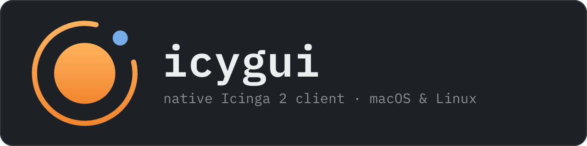
</p>

<h3 align="center">Your Icinga 2, live on the desktop.</h3>

<p align="center">
  A native, keyboard-first monitoring client for on-call engineers.<br>
  Problems arrive within a second, notifications follow your rules, and the master barely notices.
</p>

<p align="center">
  <a href="https://github.com/alexykn/icygui/actions/workflows/ci.yml"></a>
  <a href="https://github.com/alexykn/icygui/releases"></a>
  
  <a href="LICENSE"></a>
  
</p>

<p align="center">
  <a href="#install"><b>Install</b></a> ·
  <a href="#try-it-in-30-seconds"><b>Try the demo</b></a> ·
  <a href="#why-icygui"><b>Why icygui</b></a> ·
  <a href="docs/user-guide.md"><b>User guide</b></a>
</p>

<p align="center">
  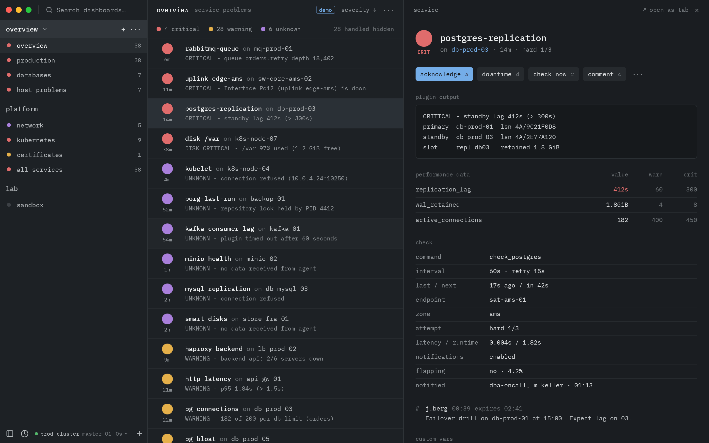
</p>

## See it move

<table>
  <tr>
    <td width="50%" valign="top">
      <br>
      <b>Live, not refreshed.</b> One event stream from Icinga: new problems, recoveries and counts update in about a second, with no polling.
    </td>
    <td width="50%" valign="top">
      <br>
      <b>Keyboard-first.</b> <kbd>j</kbd> <kbd>k</kbd> to move, <kbd>Enter</kbd> to open, <kbd>a</kbd> to acknowledge. The row leaves the list the moment Icinga confirms.
    </td>
  </tr>
  <tr>
    <td width="50%" valign="top">
      <br>
      <b>One palette for everything.</b> <kbd>⌘K</kbd> / <kbd>Ctrl K</kbd> finds hosts, services, dashboards and commands. Start with a verb (<code>ack</code>, <code>dt</code>, <code>check</code>) to act on what you type.
    </td>
    <td width="50%" valign="top">
      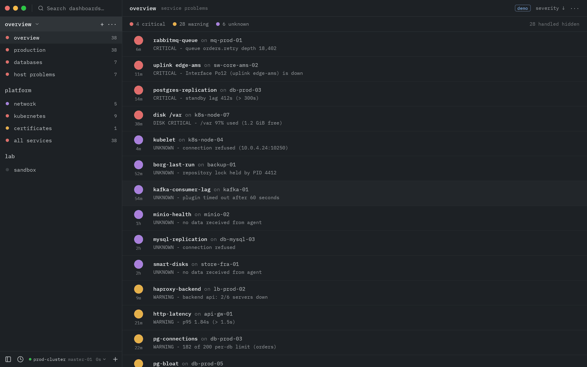<br>
      <b>Dashboards in Icinga's own filter language.</b> The preview, the match count and any error position update as you type.
    </td>
  </tr>
</table>

## A quick tour

<table>
  <tr>
    <td width="50%" valign="top">
      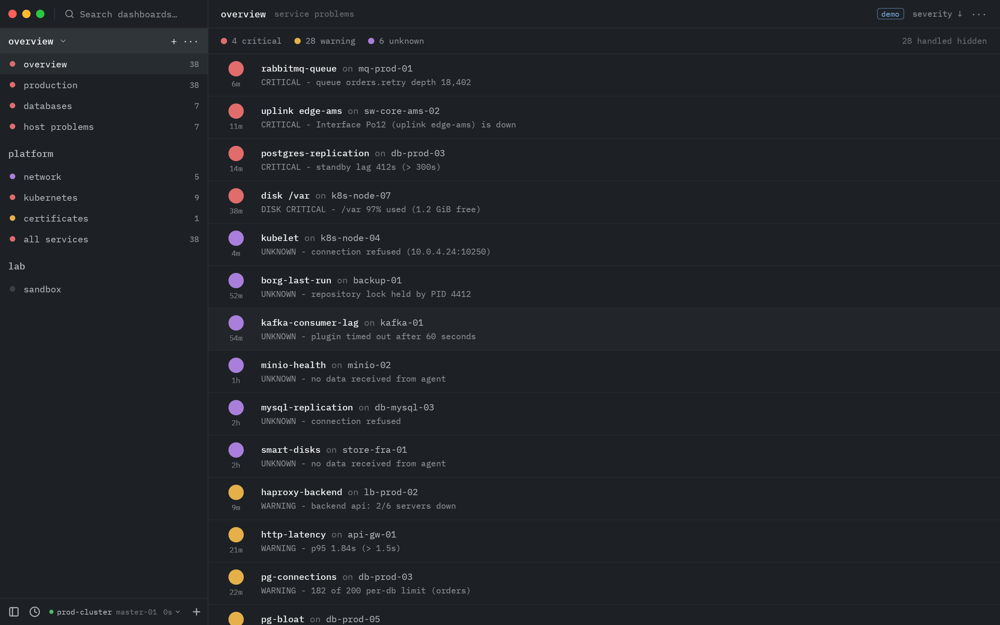<br>
      <b>Problem lists like Icinga Web, only live.</b> State circles, time in state, <code>service on host</code>, the output; dashboards in sidebar groups with their worst state and count.
    </td>
    <td width="50%" valign="top">
      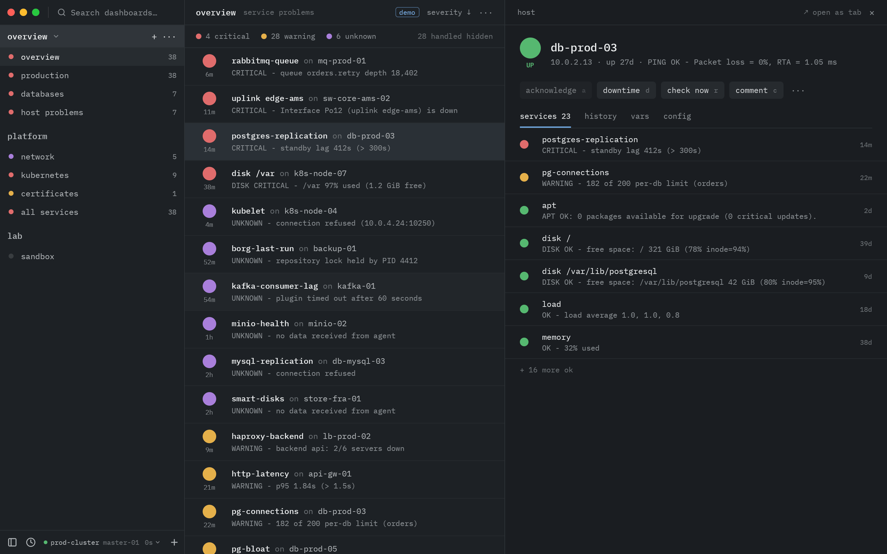<br>
      <b>Hosts at a glance.</b> Address, uptime and its services (OK ones folded away), plus history, vars and the read-only check config.
    </td>
  </tr>
  <tr>
    <td width="50%" valign="top">
      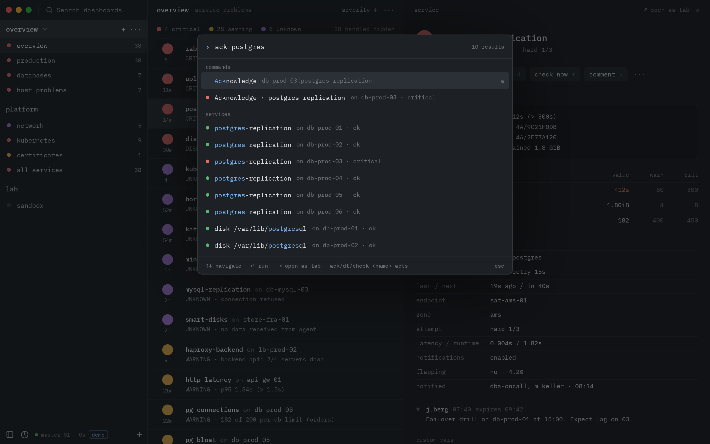<br>
      <b>Act by typing.</b> <code>ack postgres</code> offers the acknowledgement for the problem first, then every match.
    </td>
    <td width="50%" valign="top">
      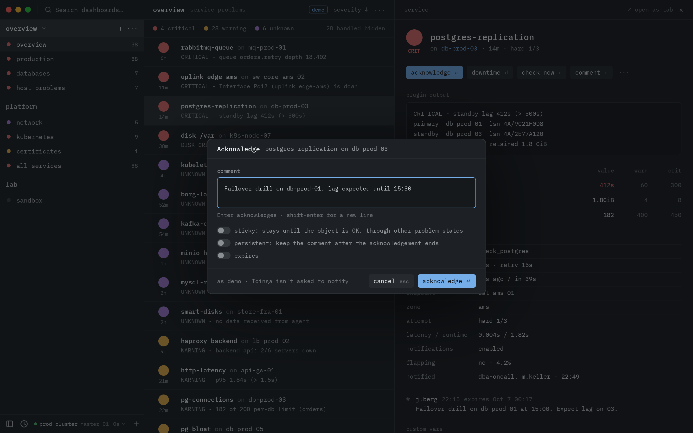<br>
      <b>Runtime actions only.</b> Acknowledge, downtimes, check now, comments, passive results, run command. Never config, never object attributes.
    </td>
  </tr>
  <tr>
    <td width="50%" valign="top">
      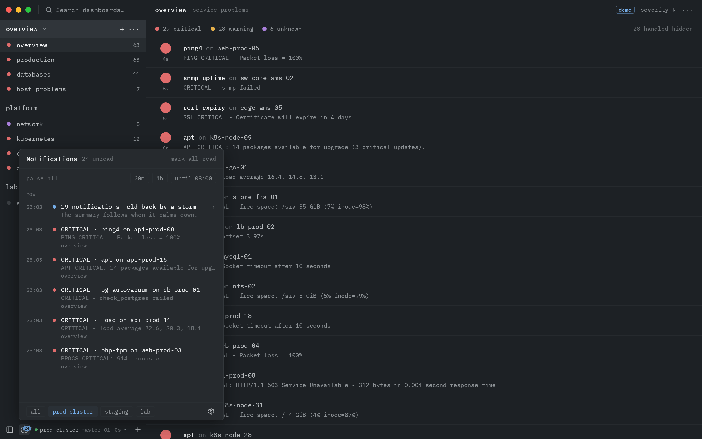<br>
      <b>A storm is one notification, not fifty.</b> The centre keeps every notification, silent ones included; pause for 30 minutes, an hour or until 08:00.
    </td>
    <td width="50%" valign="top">
      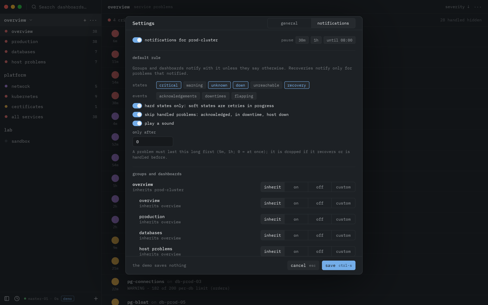<br>
      <b>Rules you control.</b> Per environment, group, dashboard and object: states, hard only, skip handled, minimum duration, quiet hours, storm control.
    </td>
  </tr>
  <tr>
    <td width="50%" valign="top">
      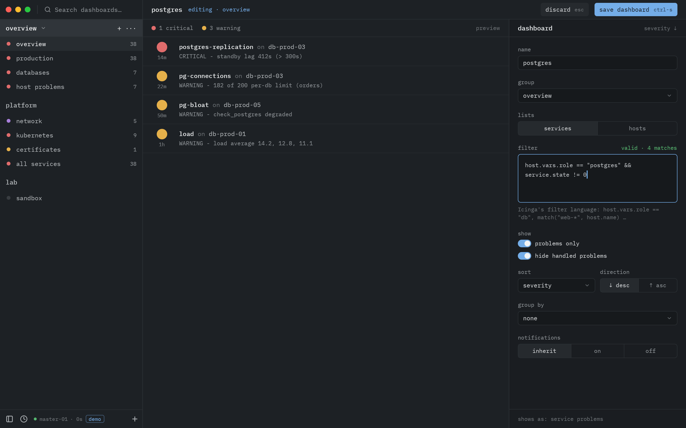<br>
      <b>Build a dashboard in seconds.</b> Hosts or services, a filter, problems only, hide handled, sort and group by host, host group or service group.
    </td>
    <td width="50%" valign="top">
      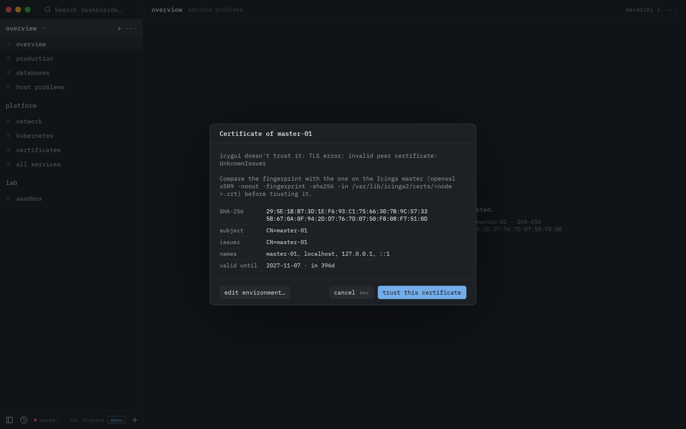<br>
      <b>TLS done properly.</b> Icinga's CA, a pinned fingerprint or trust on first use after comparing the fingerprint, server-name override, client certificates.
    </td>
  </tr>
</table>

<sub>Every screenshot and clip here is generated from <code>icygui --demo</code> by <code>cargo xtask screenshots</code>, so it shows the app as it is.</sub>

## Why icygui

Icinga Web is great for history, reporting and the big picture. icygui is for the person holding the pager.

| | |
|---|---|
| **Native and fast** | Rust and [GPUI](https://www.gpui.rs) (the GPU-rendered UI framework behind the Zed editor), no browser tab. Built and measured for 2 000 hosts and 30 000 services: problem lists are complete within seconds, lists are virtualised, and dashboards update incrementally. |
| **Live** | One event stream from the Icinga 2 API keeps every list, count and pane current within about a second. Checks that should have reported but didn't are marked *late*. |
| **Downtimes you can't miss** | An object in downtime says so at the top of its pane: since when and until when, how long is left, who set it and why, and *remove downtime*; also when the downtime comes from its host, or starts later. Hollow circle = handled, everywhere: acknowledged, or in a downtime that is in effect. |
| **Keyboard-first** | <kbd>j</kbd>/<kbd>k</kbd>, <kbd>Enter</kbd>, <kbd>Esc</kbd>, <kbd>x</kbd> to mark rows, <kbd>a</kbd> acknowledge, <kbd>d</kbd> downtime, <kbd>r</kbd> check now, <kbd>c</kbd> comment, <kbd>⌘K</kbd> for everything else. Bulk actions on marked rows, with per-object results. |
| **Native notifications with sane rules** | Desktop notifications with *Acknowledge* and *Open* buttons, decided on your machine: hard states only, handled problems skipped, recoveries only for problems that notified, one notification per problem however many dashboards show it, storms collapsed into a summary, quiet hours, pause. It keeps watching every environment from the tray or menu bar after you close the window. |
| **Gentle on the master** | One lean load when it connects (about 35 MB at 30 000 services; started at login, after a random wait that grows with the installation, so a whole team doesn't load at nine sharp), then the event stream (about 75 KB/s; under 1 KB/s in *quiet mode*, while nobody looks: notifications stay instant). A lean reconcile every 5 to 60 minutes, depending on the size and on how steadily the stream runs, catches anything missed. No polling, no periodic full reloads, no re-query per event. |
| **Least privilege** | Works with an API user without `filter-expression`. It only uses runtime operations under `/v1/actions`; it never changes Icinga's configuration or object attributes. Running commands on agents (`execute-command`) is opt-in and left out of the ready-made API user. Buttons for actions your user may not run are disabled and say why. |
| **Shareable dashboards** | Dashboards live in groups in the sidebar, per environment. Export a group to a file and a colleague imports it. |
| **Several Icinga environments** | Production, staging, lab: all of them stay connected and notify (the title says which one), and switching between them from the footer or the palette is instant. The switcher and the notification centre show which ones have unread notifications; the centre lists one environment or all of them. Pause them all, or mute one. Each costs its Icinga one event stream, a quiet one without check results while it is off screen. Passwords stay in the system keychain. |

## Install

**macOS and Linux, one line** (verifies the download against the release's checksums; run it again to update):

```sh
curl -fsSL https://raw.githubusercontent.com/alexykn/icygui/main/install.sh | bash
```

On macOS this installs `icygui.app` into `/Applications`; on Linux the binary, desktop entry and icons go into `~/.local` (no sudo). An update quits the running icygui first (on Linux, start it again afterwards). While there is no full release yet, the script installs the newest release candidate and says so. Pin a version with `… | bash -s -- --version 0.1.0-rc.1`, remove the app with `… | bash -s -- --uninstall` (add `--purge` to drop the settings too).

**Packages.** The [releases page](https://github.com/alexykn/icygui/releases) has a universal `.dmg` for macOS and `.deb` and `.tar.gz` packages for Linux on x86_64 and arm64, with `SHA256SUMS` and build-provenance attestations. macOS builds aren't notarized yet: `install.sh` handles that for you; after a browser download, open the app once via System Settings → Privacy & Security → *Open Anyway*.

**Homebrew.** When a release has published the tap: `brew install --cask alexykn/tap/icygui` on macOS, `brew install alexykn/tap/icygui` on Linux.

**From source** (Rust is installed by `rustup` from `rust-toolchain.toml`): `cargo xtask install` on Linux, `cargo xtask bundle --release` on macOS. See [docs/development.md](docs/development.md) for the build dependencies.

## Try it in 30 seconds

No Icinga needed:

```sh
icygui --demo
```

The whole app runs against a simulated Icinga in the same process: a 150-host production estate with checks, new problems, recoveries, flapping, outages, downtimes and a problem storm every five minutes. Every action works against it. Nothing is saved and the keychain isn't touched.

## Quick start

1. **Create an API user.** Paste the ready-made, least-privilege `ApiUser` from the [user guide](docs/user-guide.md#the-api-user) into your Icinga config (or your Ansible role) and reload Icinga.
2. **Start icygui.** The first window asks for a name, the API URL (`https://<master>:5665`; an HA pair or a cluster with satellites gets one URL per node, see [clusters](docs/user-guide.md#clusters-which-urls-to-list)), the API user and its password.
3. **Trust the certificate.** Point it at Icinga's CA (`/var/lib/icinga2/certs/ca.crt`), or press *test connection*, compare the fingerprint it shows with the master's, and *trust this certificate*. See [TLS](docs/user-guide.md#tls).
4. **Connect.** You start with an *overview* group: problems, host problems, all services. Press <kbd>⌘K</kbd> / <kbd>Ctrl K</kbd> and start typing.

Trying it against production for the first time? Read the [first-run checklist](docs/first-run.md).

## Documentation

| | |
|---|---|
| [User guide](docs/user-guide.md) | Installation, the `ApiUser`, TLS, environments, dashboards and filters, keyboard shortcuts, actions, notifications, files, troubleshooting |
| [First run](docs/first-run.md) | Checklist for the first connection to a production Icinga |
| [Development](docs/development.md) | Building, testing, the demo's switches, `cargo xtask` |
| [Architecture](docs/architecture.md) · [Plan](PLAN.md) | Crate contracts, decisions |
| [Performance](docs/performance.md) | Measurements at production scale and how the client stays gentle on the master |
| [Releasing](docs/releasing.md) | Release pipeline, signing, Homebrew |

## Status

Release candidate: everything planned for the first release is built, and CI builds and tests it on Linux and macOS. The desktop integration has so far only run on Linux, though: on macOS the menu-bar icon, notifications with their *Acknowledge* and *Open* buttons, launch at login and keychain access after an update are still unverified (the [Mac checklist](docs/spikes.md#still-to-run-on-a-mac)). The first production trial is next. Work on v1 has begun on the development branch: a settings panel in the style of Zed's, the appearance settings (a light theme that follows the desktop's light or dark mode, three interface sizes, compact rows and clock times in lists), and downtimes shown prominently in the panes. Multi-view dashboards, a host-group grid and cluster health come after it (see [PLAN.md](PLAN.md)).

## Licence

MIT, see [LICENSE](LICENSE). icygui bundles IBM Plex Mono (SIL Open Font License 1.1) and Lucide icons (ISC); see [THIRD_PARTY_NOTICES.md](THIRD_PARTY_NOTICES.md).
